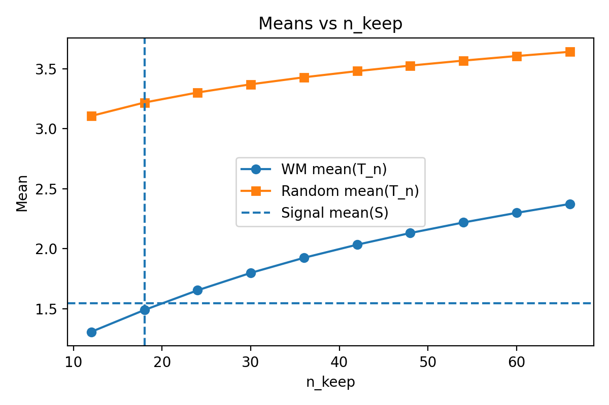
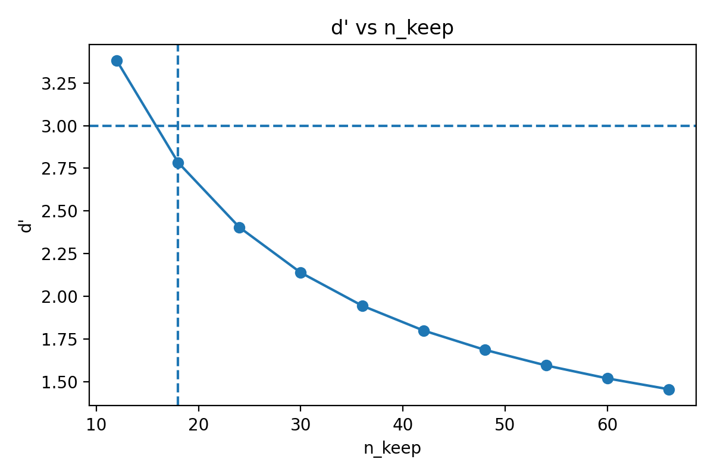
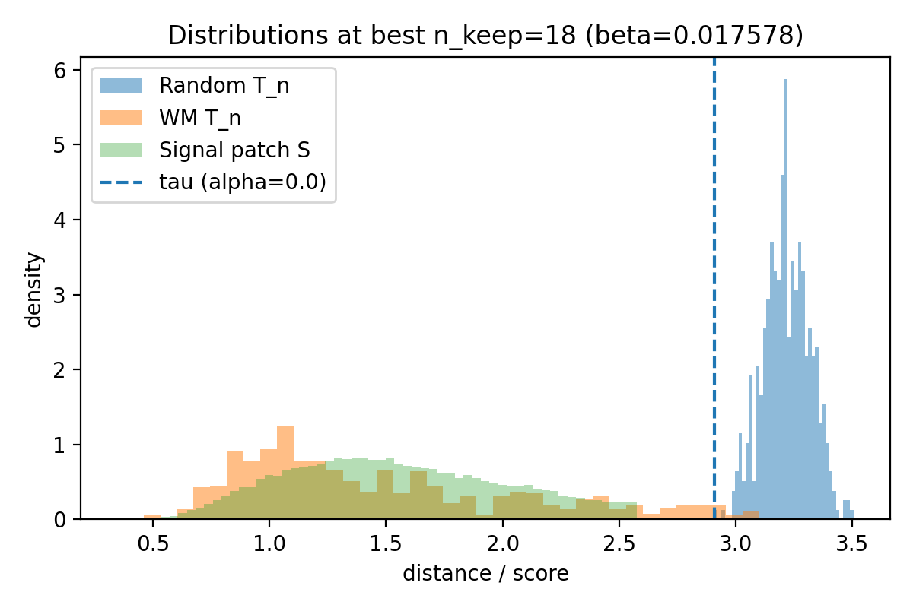

# Wasserstein-based $\beta$ / $n_{keep}$ selection report

**Inputs (pooled):** 8 NPZ files  
**Total images:** WM = 525, Random = 525  
**Patches per image:** K = 1024  
**Alpha (null quantile for $\tau$):** 0.0

## Patch-level signal reference $S$ (GMM on pooled WM patches)

2-component 1D GMM means: [5.462492, 1.547012]  
Signal component (lower mean): 1  
Signal selection rule: $S=\{d: P(\text{signal}\mid d) \ge 0.5\}$

| metric | value |
|---|---:|
| |S| | 44401 |
| mean(S) | 1.542570 |
| var(S) | 0.214110 |

## Wasserstein objective and chosen trimming level

We compute per-image trimmed means $T_n(i)=\frac1n\sum_{j=1}^n d_{(j)}(i)$ using the **n smallest** patch distances.

Objective: $D(n)=W_1(T_n, S)$ (empirical 1D Wasserstein-1).

**Best:** $n_{keep}^\star=18$, $\beta^\star=n_{keep}^\star/K=0.01757812$  
At $n_{keep}^\star$, threshold $\tau$ from Random lower $\alpha$-quantile is **2.907661**.

### Key plots

## Full table

See `wasserstein_beta_table.csv` for all per-$n$ numbers (W1, moments, $d'$, $\tau$, TPR/FPR).
